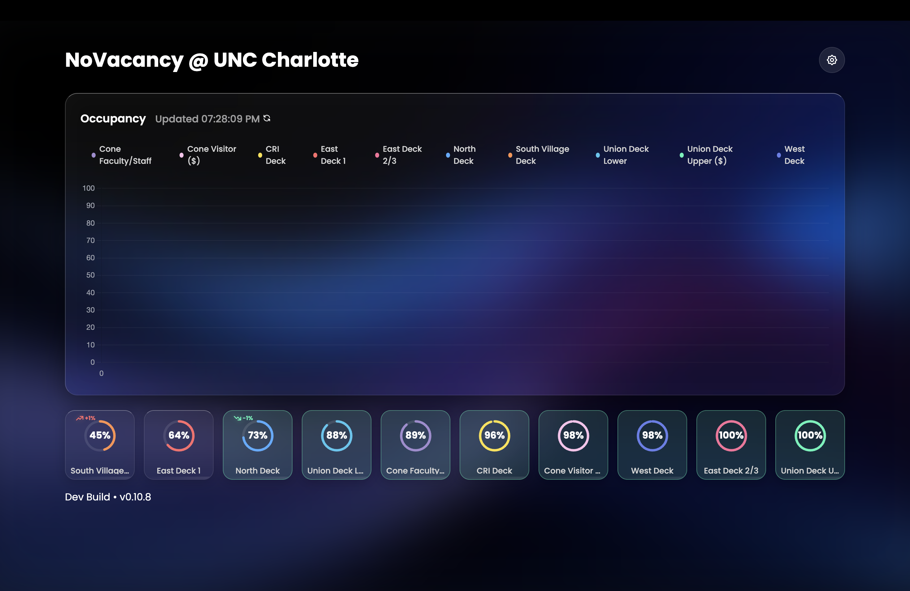
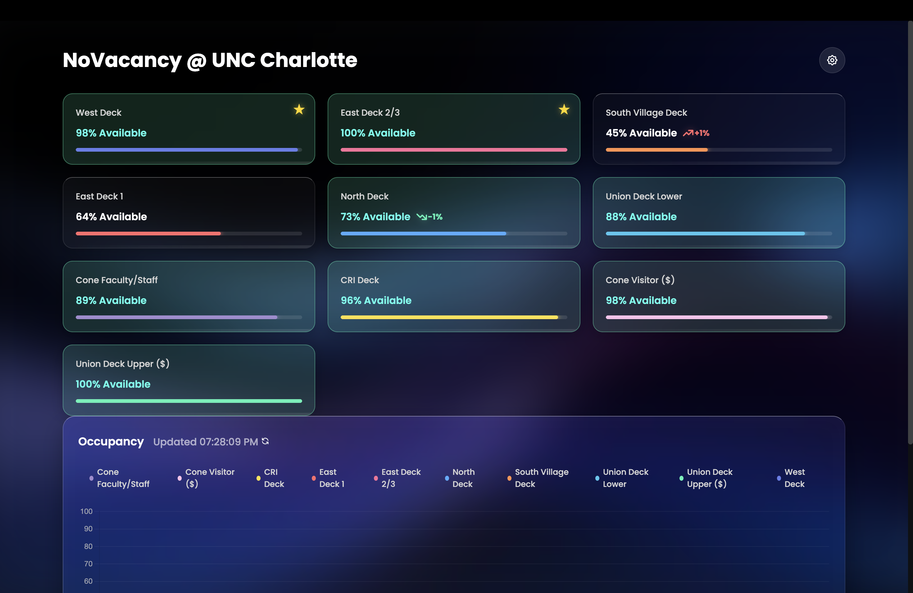

# NoVacancy
**Campus Parking Occupancy Predictor & Visualizer for UNC Charlotte**

NoVacancy is a web application designed to give UNC Charlotte students quick insights into parking availability.  
It analyzes occupancy data to provide live updates, historical trends, and forecasted crowd levels.

---

### Features
- **Occupancy Forecasting** – Predicts building crowd levels using machine learning models.  
- **Historical Trends** – Interactive, zoomable graphs let you browse occupancy history and usage patterns.  
- **Live Updates** –  Parking data refreshes in real-time every 5 seconds. 
- **Data-driven Insights** – Data analysis finds patterns in campus usage, providing glanceable insights into usage patterns and best times to leave for a particular deck.  

---

### Tech Stack
- **Languages:** Python  
- **Libraries:** pandas, Meta Prophet
- **Web Framework:** Flask
- **Frontend:** React, JavaScript, CSS
- **Hosting:** Firebase, Google Cloud

---

### Beta Screenshots




---

### File Structure
```
novacancy/
│
├── forecastModels/     # Forecasting scripts and ML models
├── data/               # Collected occupancy data
├── static/             # Planned assets (CSS/JS)
├── templates/          # Planned web templates
├── forecast_model.py
└── README.md
```

---

### About This Project
NoVacancy is for educational and personal research use.
Developed at UNC Charlotte by Michael Onate.
</file>
