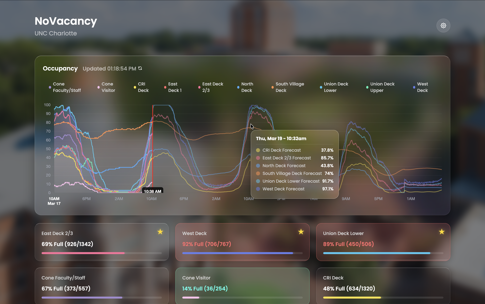

# NoVacancy
**Campus Parking Occupancy Predictor & Visualizer for UNC Charlotte**

NoVacancy is a web application designed to give UNC Charlotte students quick insights into parking availability.  
It analyzes occupancy data to provide live updates, historical trends, and forecasted crowd levels.

---

### Features
- **Occupancy Forecasting** – Predicts parking deck occupancy levels using machine learning models.  
- **Historical Trends** – Interactive graphs let you browse occupancy history and usage patterns in the last day, week, and month.
- **Live Updates** –  Parking data refreshes in real-time every 5 seconds. 
- **Data-driven Insights** – Data analysis finds patterns in campus usage, providing glanceable insights into usage patterns and best times to leave for a particular deck.  

---

### Tech Stack
- **Languages:** Python, JavaScript, HTML, CSS
- **Libraries:** pandas, Meta Prophet
- **Web:** HTML, CSS, JavaScript
- **Backend:** Python
- **Database/Hosting:** Firebase, Google Cloud

---

### Beta Screenshots
_Images are proof-of-concept. Their design and functionality may change and does not represent the final product_

---

### About This Project
NoVacancy is a personal project developed at UNC Charlotte by Michael Onate.
_Source code is private._

</file>
