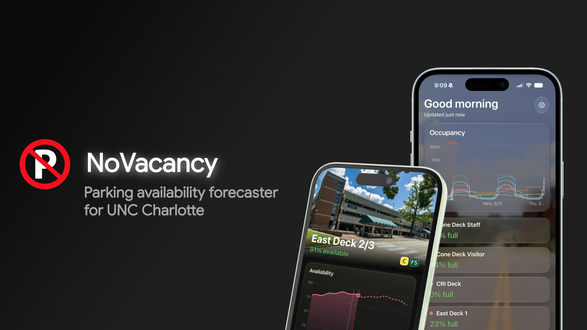

# NoVacancy - Campus Parking Availability Forecaster

> [!IMPORTANT]
> The core source code is maintained in a private repository. Snippets of code that enables this project are available in the [snippets](/snippets) folder.
---

## Features
- **Live Parking Availability** – View near real-time occupancy updates for campus parking decks.
- **Onyx Forecasting Engine** – Custom-built machine learning models forecast parking availability up to 48 hours into the future
- **Historical Calendar** – Browse historical parking conditions for any day to view trends, special events, holidays, and weather impacts.
- **Beautiful iOS app** - NoVacancy on iOS provides an intuitive and modern app experience. Designed from the ground up to be glanceable, power efficient, and feature-rich.

## Meet Onyx
Onyx is the name for the predictive intelligence behind NoVacancy. This custom-built machine learning model predicts availability using historical occupancy, weather, school academic and athletic calendars, and more. 
- Extensively tested using walk-forward historical backtesting to evaluate performance across thousands of real-world forecasts.
- Typical forecast error lands approximately within **6 percentage points**. It learns continuously as new parking data becomes available.

*A live Forecast Accuracy Report is planned for a future release so users can view real-world model performance directly in the app.*

---

### Tech Stack

- **Languages:** Python, Swift, SQL
- **Frameworks:** SwiftUI, Flask, Gunicorn
- **Machine Learning:** scikit-learn, pandas, NumPy
- **Database:** PostgreSQL
- **Cloud:** Google Cloud Run, Cloud SQL, Cloud Scheduler, Docker
- **Authentication:** Firebase Authentication

## Download NoVacancy
NoVacancy Campus is available now on the [App Store](https://apps.apple.com/us/app/novacancy-campus/id6793805724)

---

## License

**All Rights Reserved.**

Copyright © 2026 Michael Onate

This project contains proprietary software developed by the author. The source code, forecasting pipeline, and other original content is private and may not be copied or used to create derivative works without prior written permission.

Parking occupancy data and other third-party materials remain the property of their respective owners and are used subject to applicable permissions and terms.

</file>
